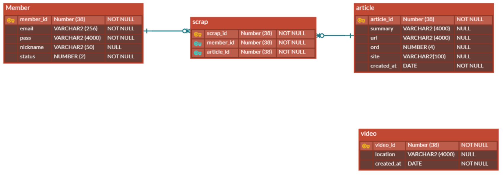
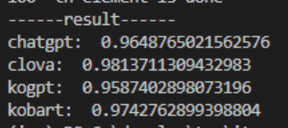

# it_news_generator (ING, IT 뉴스 생성기)

* IT 뉴스 기사를 요약하여 동영상 형태로 제공하는 서비스입니다.
* 매일 아침 식사를 하며 동영상으로 IT 뉴스를 확인하고 싶었습니다. 하지만, IT 뉴스를 동영상으로 제공하는 서비스를 찾기 어려워서 제작하였습니다.

 

## 주요 정보
* <b>주요 기능</b>: 이 [파일](https://drive.google.com/file/d/1ETtzkMOlt5W9-YM7uJKIrX3xLDRoCqsL/view) 참고 바랍니다.
* <b>제작 기간</b>
  * 총 7주 
  * 2023.06.15 ~ 2023.07.06 (3주)
  * 2023.08.22 ~ 2023.09.22 (4주)

* 개인 프로젝트라서 역할 분배는 기재하지 않았습니다.

 

## 기술 스택

* 최근 [멀티캠퍼스](https://event.multicampus.com/backend)에서 보조강사 근무를 마쳤기에 당시 사용한 기술 스택으로 프로젝트를 제작하고 싶었습니다. 

* Back-end
  * Java 8
  * SpringBoot 2.7
  * Spring Security 2.7
  * Maven 2
  * JPA 2.7

* Database
  * Oracle 11g

* News Crawl & Summary
  * Python 3.10
  * KoBart: 기사 요약
  * BeautifulSoup: 기사 크롤링

* Front-end
  * Axios
  * JSP
  * HTML/CSS/JavaScript

* ETC
  * Apache Tomcat 9
  * GitHub

 

## ERD

 

## 주요 소스 코드

* 이 [코드](https://github.com/chkim4/it_news_generator/blob/f4090f5136b2b9aa17e837086397f52fdcaadcf0/ing/src/main/java/com/ing/config/CustomAuthenticationProvider.java#L19C78-L19C78)를 통해 Spring Security의 인증 과정을 재정의하였습니다.

* 이 [코드](https://github.com/chkim4/it_news_generator/blob/f4090f5136b2b9aa17e837086397f52fdcaadcf0/ing/src/main/java/com/ing/repository/ArticleRepository.java#L40)를 통해 Article과 Scrap 엔티티 간 조인 연산을 구현하였습니다.

* 이 [코드](https://github.com/chkim4/it_news_generator/blob/f4090f5136b2b9aa17e837086397f52fdcaadcf0/ing/src/main/java/com/ing/utils/NewsUtils.java#L57)처럼 복잡한 내용은 JavaDoc 형식에 맞추어 자세히 주석 처리하였습니다.

* 이 [코드](https://github.com/chkim4/it_news_generator_data/blob/29033997aabd62a765f04e3f75167a06c316a5db/test_alters/news_summary/compare_model.py#L31)에서 BERT 모델을 활용하여 KoBart 모델과 API들의 문서 요약 성능을 비교하였습니다. 

  * 

      
비교 결과

      
    

 

## 후기

### 잘한 점

* [이전 프로젝트](https://github.com/chkim4/drd)에서 미흡했던 외부 라이브러리 버전 통합과 화면 레이아웃 구현을 수행하였습니다.
  * 외부 라이브러리의 버전 통합을 위해 별도의 [jsp 파일들](https://github.com/chkim4/it_news_generator/tree/master/ing/src/main/webapp/WEB-INF/views/cdn)을 만들었습니다. [header.jsp](https://github.com/chkim4/it_news_generator/blob/f4090f5136b2b9aa17e837086397f52fdcaadcf0/ing/src/main/webapp/WEB-INF/views/layout/header.jsp#L16), [login.jsp](https://github.com/chkim4/it_news_generator/blob/f4090f5136b2b9aa17e837086397f52fdcaadcf0/ing/src/main/webapp/WEB-INF/views/login.jsp#L12)등에서 해당 jsp 파일을 include 하였습니다.

  * [layout 폴더](https://github.com/chkim4/it_news_generator/tree/master/ing/src/main/webapp/WEB-INF/views/layout)에 여러 화면에서 필요한 공통 요소를 구현하였습니다.

 

### 개선할 점
* 크롤링에 활용한 네이버 IT 일반 뉴스는 IT 말고도 다양한 분야의 기사를 포함합니다. 따라서, IT 분야의 뉴스만을 크롤링하는 방안이 필요합니다.

* 이메일 인증 기능, [비밀번호 설정 규칙](https://www.kisa.or.kr/2060301/form?postSeq=8&page=1#fnPostAttachDownload) 적용 등 계정 관련 기능을 개선해야 합니다.

* 영상 생성이 오래 걸리며 뉴스는 하루에 여러 번 업로드 되기에 해결 방안이 필요합니다.
